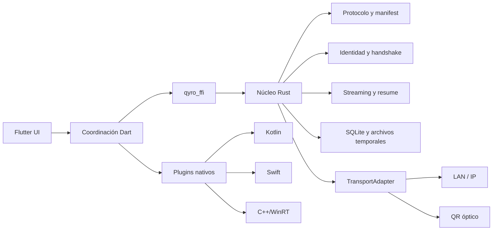
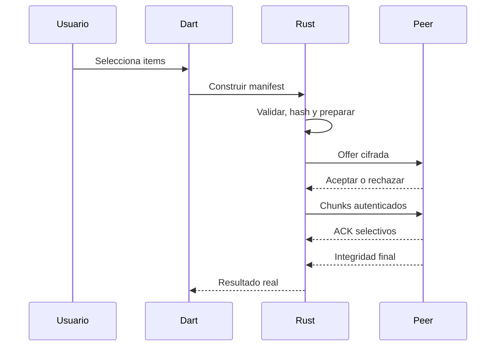

# Arquitectura

## Componentes

Las flechas son dependencias. El núcleo Rust no depende de Flutter ni de APIs de plataforma.

## Envío

## Recepción

Una offer desconocida requiere confirmación. Cada archivo se escribe como .qyro-part, se limita y valida, se sincroniza, se comprueba tamaño/autenticidad/hash y solo entonces se renombra atómicamente.

## Emparejamiento

QR o IP entregan candidatos, sesión, expiración, nonce, capacidades, clave efímera y huella. Dispositivos no confiables comparan SAS. Nunca se transportan claves privadas.

## Óptico

Contenido cifrado → epochs → RaptorQ → frames Qyro autenticados → matrices QR. El receptor deduplica, reconstruye epochs, verifica y persiste. RaptorQ, fast_qr y ZXing-C++ siguen en evaluación; no están integrados.

## Concurrencia

UI solo coordina. Hashing, cifrado, archivos, compresión, QR/FEC y cámara viven en isolates, workers o threads nativos. Se exige backpressure y memoria acotada.

## Errores y persistencia

Los errores serán tipados y localizables. Resume state y metadatos cifrados vivirán en SQLite; archivos completos no. Las rutas completas, nombres y claves se excluyen de logs.

## Estado implementado

Solo qyro_core, ABI C mínima y ScrambleDecodeEngine. El resto de este documento es arquitectura aprobada, no funcionalidad terminada.
