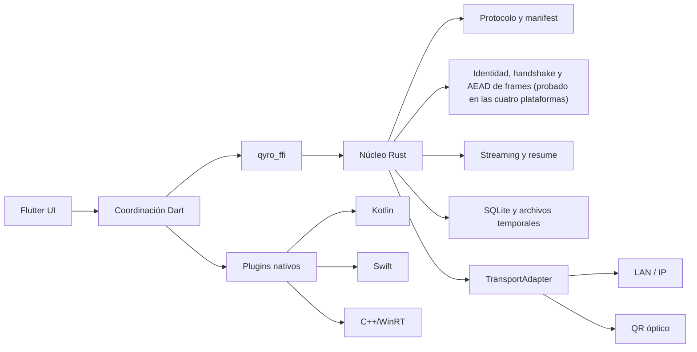
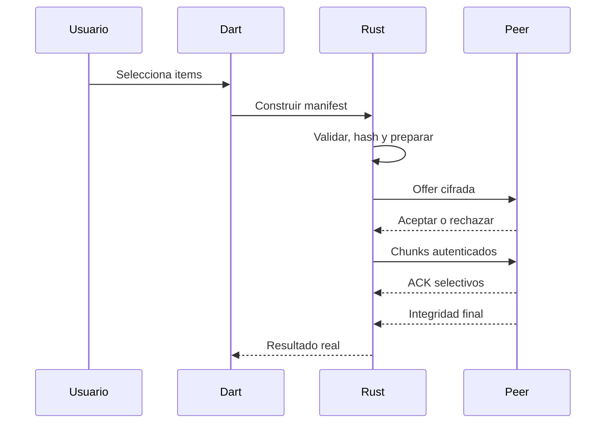

# Arquitectura

## Componentes

Las flechas son dependencias. El núcleo Rust no depende de Flutter ni de APIs de plataforma.

## Envío

## Recepción

Una offer desconocida requiere confirmación. Cada archivo se escribe como .qyro-part, se limita y valida, se sincroniza, se comprueba tamaño/autenticidad/hash y solo entonces se renombra atómicamente.

## Emparejamiento

QR o IP entregan candidatos, sesión, expiración, nonce, capacidades, clave efímera y huella. Dispositivos no confiables comparan SAS. Nunca se transportan claves privadas.

## Óptico

Contenido cifrado → epochs → RaptorQ → frames Qyro autenticados → matrices QR. El receptor deduplica, reconstruye epochs, verifica y persiste. RaptorQ, fast_qr y ZXing-C++ siguen en evaluación; no están integrados.

## Concurrencia

UI solo coordina. Hashing, cifrado, archivos, compresión, QR/FEC y cámara viven en isolates, workers o threads nativos. Se exige backpressure y memoria acotada.

## Errores y persistencia

Los errores serán tipados y localizables. Resume state y metadatos cifrados vivirán en SQLite; archivos completos no. Las rutas completas, nombres y claves se excluyen de logs.

## Estado implementado

**Un archivo cruza.** El selector del sistema lo elige, `qyro_manifest` lo
describe, `qyro_transfer` lo trocea, `qyro_crypto` sella cada frame,
`qyro_net` lo pone en un socket, `qyro_fs` lo materializa tras verificar el
SHA-256, y `qyro_session` es la fachada por la que pasan los dos consumidores:
la aplicación de Flutter a través de `qyro_ffi`, y el binario de terminal
directamente. Los cuatro canales —red local, cable directo, óptico y serie—
comparten el mismo framing.

**Lo que no está terminado se dice por su nombre**, y no como un estado global:
la reanudación existe en el motor y no la llama nadie, el historial tampoco, y
`Pause`/`Resume`/`Retransmit` sólo los llaman las pruebas. La lista viva está en
`docs/reports/revision-final.md` §5.

**Y lo que no existe es la evidencia de hardware.** Nada de esto ha corrido
nunca en un teléfono ni en un PC con Windows: `docs/testing/hardware-protocol.md`,
veintiséis huecos en blanco.

> **La frase que estuvo aquí hasta 2026-08-31 decía que lo único implementado
> era «qyro_core, ABI C mínima y ScrambleDecodeEngine», y que el resto era
> «arquitectura aprobada, no funcionalidad terminada».** Dejó de ser cierta en
> la fase 12 y siguió escrita dieciséis fases. Se deja aquí para que no vuelva
> (QYR-0395).
